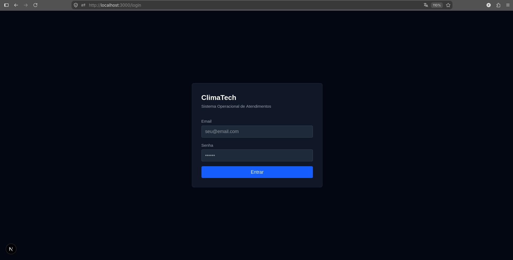
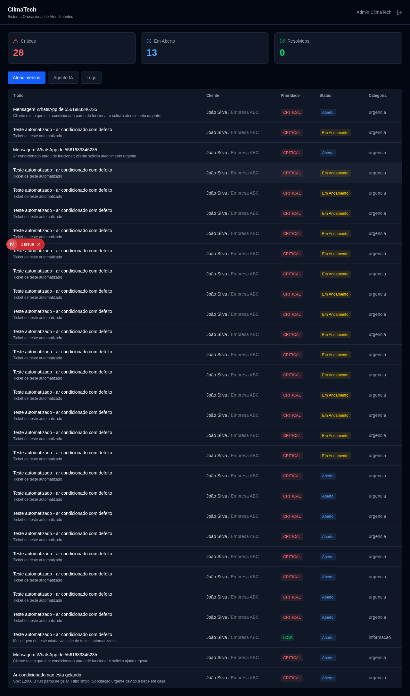
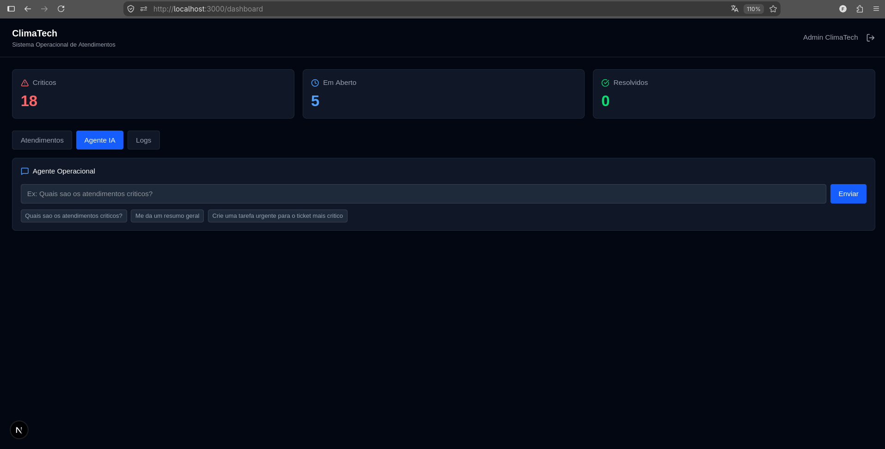
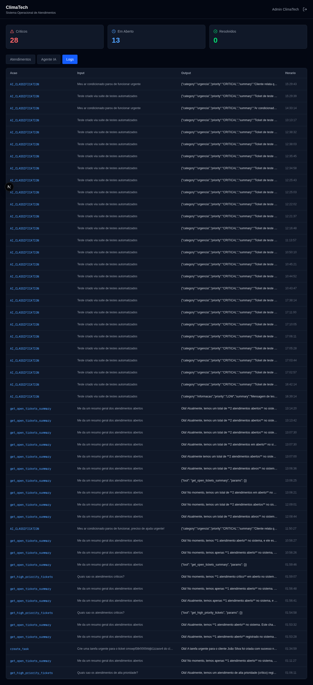

# ops-ai-agent

[](https://github.com/fernandogrimello/ops-ai-agent/actions/workflows/ci.yml)


Plataforma de automacao operacional com IA para empresas de servicos.

Desenvolvido como laboratorio pratico para explorar agentes de IA, automacao de processos e integracao entre APIs REST, banco de dados e ferramentas externas. O cenario ficticio e a ClimaTech, empresa de manutencao e instalacao de ar-condicionado.


## Screenshots

### Login

### Dashboard de Atendimentos

### Agente IA


## Screenshots

### Login


### Dashboard de Atendimentos


### Agente IA


### Logs do Agente


## O problema

Empresas de servicos recebem dezenas de solicitacoes por dia e perdem tempo classificando manualmente cada uma, cadastrando clientes, criando tarefas e distribuindo os servicos. O objetivo deste projeto e automatizar esse fluxo usando IA.

## Arquitetura

Cliente envia mensagem no WhatsApp
        |
WAHA recebe via webhook
        |
n8n processa e chama API REST
        |
API Node.js/Express
        |
Google Gemini classifica: categoria, prioridade, resumo, acao
        |
PostgreSQL salva o atendimento
        |
OpenClaw gateway disponibiliza agente via HTTP
        |
WAHA envia resposta automatica ao cliente

## Tecnologias

| Camada | Tecnologia |
|---|---|
| Backend | Node.js, Express, TypeScript, Prisma ORM |
| Banco | PostgreSQL 16 |
| IA | Google Gemini API, agente com ferramentas |
| Agente Gateway | OpenClaw (skills, memoria, canais) |
| WhatsApp | WAHA (engine NOWEB) |
| Automacao | n8n (webhook + HTTP requests) |
| Infra | Docker, Docker Compose |
| Testes | Jest, Supertest, k6 |

## API

| Metodo | Rota | Descricao |
|---|---|---|
| POST | /auth/register | Cadastro de usuario |
| POST | /auth/login | Login com JWT |
| GET | /customers | Lista clientes |
| POST | /customers | Cria cliente |
| GET | /tickets | Lista atendimentos (paginado: ?page=1&limit=20&status=OPEN&priority=CRITICAL) |
| POST | /tickets | Cria atendimento com classificacao por IA |
| POST | /agent/chat | Conversa com o agente operacional |
| GET | /agent/logs | Historico de acoes do agente |
| GET | /health | Health check |

## Testes

### Suite de testes (Jest + Supertest)

cd apps/api && npm test

| Suite | Testes | Cobertura |
|---|---|---|
| auth.test.ts | 5 | Login, token JWT, /me |
| tickets.test.ts | 15 | CRUD + GET/:id + PUT/:id + mock IA |
| customers.test.ts | 16 | CRUD + GET/:id + PUT/:id + DELETE/:id |
| agent.test.ts | 5 | Chat + logs + mock IA |
| security.test.ts | 12 | Headers, auth, injecao, rate limit |
| ai.service.test.ts | 4 | Unitario — classificacao IA, fallbacks |
| ops.agent.test.ts | 6 | Unitario — agente, tool calls, logs |
| components.test.tsx | 13 | Frontend — PriorityBadge, StatusBadge, StatsCard, TicketTable |
| auth.spec.ts | 4 | E2E — login, erro, redirecionamento |
| dashboard.spec.ts | 4 | E2E — metricas, tickets, abas, logout |
| contract.test.ts | 5 | Contrato — garante que a API nao quebra o frontend |
| webhook.test.ts | 5 | Webhook — simula payloads reais da Meta WhatsApp |
| ticket.tools.test.ts | 9 | Unitario — ferramentas do agente |
| **Total** | **106** | **79%** |

### Teste de performance (k6)

k6 run tests/performance/load-test.js

| Metrica | Resultado | Threshold |
|---|---|---|
| p95 latencia | 10ms | < 500ms |
| Taxa de erros | 0% | < 5% |
| Requisicoes/s | 22 | -- |
| Usuarios simultaneos | 10 | -- |
| Checks passando | 6370/6370 | 100% |

## Como executar

git clone https://github.com/fernandogrimello/ops-ai-agent.git
cd ops-ai-agent
cp .env.example .env
docker compose up -d
cd apps/api && npm install
npx prisma migrate dev
npx tsx src/server.ts

## Servicos

| Servico | Porta |
|---|---|
| API | 3001 |
| Frontend | 3000 |
| PostgreSQL | 5433 |
| n8n | 5678 |
| WAHA | 3002 |
| OpenClaw | 18789 |

## Documentacao

- [Arquitetura](docs/01-arquitetura.md)
- [Banco de dados](docs/02-banco-de-dados.md)
- [Agente IA](docs/03-agente.md)
- [Decisoes tecnicas](docs/04-decisoes-tecnicas.md)
- [Problemas e solucoes](docs/05-problemas-e-solucoes.md)
- [Testes](docs/06-testes.md)
- [Guia de instalacao](docs/GETTING_STARTED.md)

## Desafios encontrados

- Prisma 7 mudou completamente a forma de configurar datasource
- n8n dentro do Docker nao acessa localhost do host -- necessario usar IP 172.17.0.1
- Google Gemini descontinuou modelos antigos -- migrado para gemini-3.5-flash
- SDK @google/generative-ai incompativel com chaves AQ. -- migrado para @google/genai
- WAHA engine WEBJS apresentou erro No LID for user -- migrado para NOWEB
- TypeScript 7 incompativel com ts-jest -- downgrade para TS 5.8
## Roadmap de testes

O projeto esta em fase de evolucao para producao. Abaixo o status atual e o que esta sendo implementado:

### Implementado

| Tipo | Ferramenta | Status |
|---|---|---|
| Integracao (auth, tickets, customers, agent) | Jest + Supertest | 33 testes passando |
| Seguranca (headers, auth, injecao) | Jest + Supertest | 10 testes passando |
| Performance - load test | k6 | p95=10ms, 0% erros, 10 VUs |

### Implementado recentemente

| Tipo | Ferramenta | Status |
|---|---|---|
| Cobertura de controllers | Jest + Supertest | GET/:id, PUT, DELETE cobertos |
| Testes unitarios ai.service | Jest | 100% cobertura, fallbacks testados |
| Testes unitarios ticket.tools | Jest | 100% cobertura, Prisma mockado |
| Performance - stress test | k6 | 100 VUs, p95=11ms, 0% erros |
| Performance - spike test | k6 | Pico 100 VUs, p95=15ms, 0% erros |
| Performance - soak test | k6 | 30min, p95=13ms, sem memory leak |
| Rate limiting | express-rate-limit | 100 req/15min por IP |
| CI/CD | GitHub Actions | Roda em todo push no main |

### Pendente

| Tipo | Descricao |
|---|---|

| Testes de contrato | Garantir que o contrato da API nao quebra o frontend |

| Frontend - testes E2E | Playwright simulando fluxo real no browser |
| Webhook - testes de integracao | Simular payloads da Meta WhatsApp no n8n |

## Seguranca e vulnerabilidades conhecidas

### CVE: deepmerge-ts (GHSA-ggr8-5vv4-36mx)

**Severidade:** High
**Componente afetado:** deepmerge-ts < 8.0.0 (dependencia interna do Prisma 7.x)
**Status:** Aguardando correcao upstream pelo time do Prisma

Esta vulnerabilidade esta presente internamente no Prisma ORM e nao e exposta diretamente pelo codigo da aplicacao. O fix disponivel via npm audit fix --force exigiria downgrade do Prisma de 7.x para 6.x, o que quebraria a arquitetura atual que usa prisma.config.ts e o adapter PrismaPg.

A aplicacao sera atualizada assim que o Prisma lanctar uma versao 7.x com o fix incorporado.

Referencia: https://github.com/advisories/GHSA-ggr8-5vv4-36mx


## Infraestrutura e Backbone

Este projeto vai além de um simples deploy de backend e frontend.

Para funcionar em producao com todas as funcionalidades — WhatsApp, agentes de IA, automacao de workflows e gateway OpenClaw — ele requer uma infraestrutura dedicada com multiplos servicos rodando simultaneamente:

| Servico   | Funcao                                      | Porta |
|-----------|---------------------------------------------|-------|
| API       | Backend Node.js com classificacao por IA    | 3001  |
| Frontend  | Dashboard Next.js                           | 3000  |
| PostgreSQL| Banco de dados relacional                   | 5433  |
| n8n       | Orquestrador de workflows e automacoes      | 5678  |
| WAHA      | Bridge HTTP para WhatsApp                   | 3002  |
| OpenClaw  | Gateway de agentes de IA                    | 18789 |

Diferente de aplicacoes tradicionais onde o deploy resume-se a subir backend, frontend e banco de dados, este projeto exige um servidor dedicado (VPS) com Docker para manter todos os servicos ativos simultaneamente.

### Opcoes de hospedagem recomendadas

Para manter o sistema completo em producao, recomendamos:

| Provedor      | Plano           | Preco aproximado | Observacao                        |
|---------------|-----------------|------------------|-----------------------------------|
| Hetzner Cloud | CX22 (2vCPU/4GB)| EUR 3,29/mes     | Melhor custo-beneficio            |
| DigitalOcean  | Droplet Basic   | USD 6,00/mes     | Interface simples, boa documentacao|
| Vultr         | Cloud Compute   | USD 6,00/mes     | Alta disponibilidade              |

### Como fazer o deploy em VPS

```bash
# 1. Clone o repositorio no servidor
git clone https://github.com/fernandogrimello/ops-ai-agent.git
cd ops-ai-agent

# 2. Configure as variaveis de ambiente
cp .env.example .env
# Edite o .env com suas credenciais

# 3. Suba todos os servicos
docker compose up -d

# 4. Execute as migrations e seed
cd apps/api && npm install
npx prisma migrate deploy
npx prisma db seed
```

Com um unico `docker compose up -d`, toda a infraestrutura sobe automaticamente — banco, API, frontend, n8n, WAHA e OpenClaw — pronta para receber mensagens do WhatsApp e processar atendimentos com IA.
